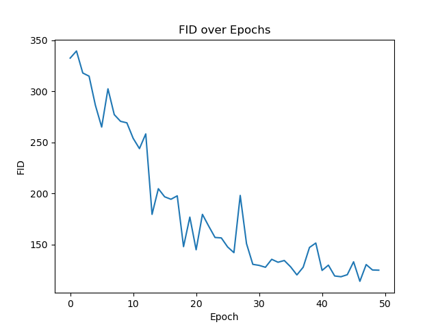
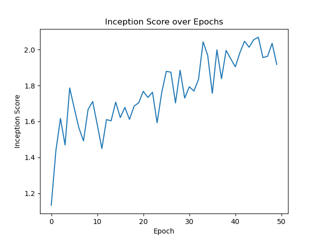
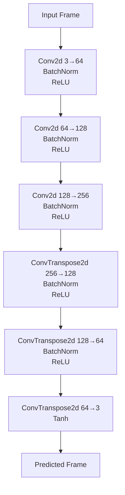
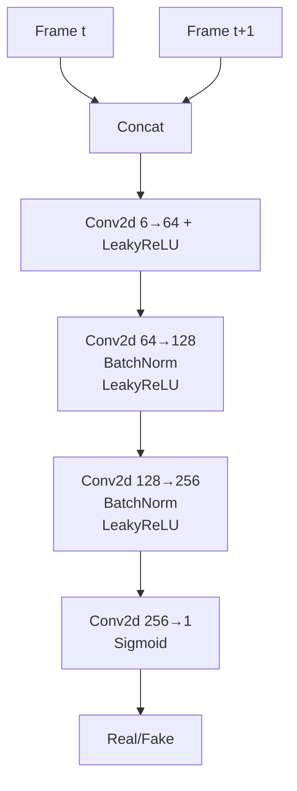
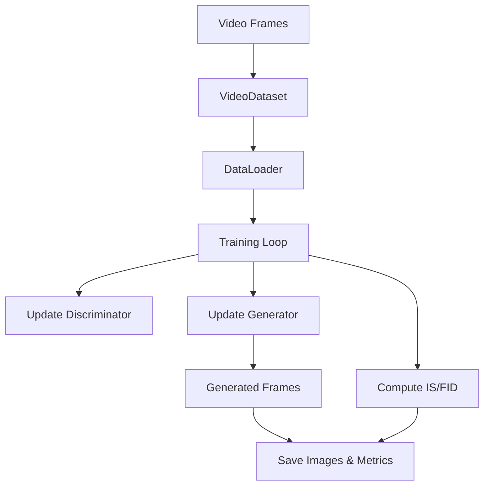

# FutureGAN Video Prediction on the HMDB Dataset

Contributors: *Girish Krishnan and Dallas Dominguez*

---

<div align="center">
  
</div>

|||
|---|---|

FutureGAN is a lightweight demonstration of a generative adversarial network used for video frame prediction. The codebase is intentionally simple and serves as a starting point for experimenting with GAN based video generation.

## Model Architecture

The generator follows an encoder-decoder design while the discriminator inspects a pair of frames. The diagrams below summarise the key layers.




## Installation

1. Clone the repository
   ```bash
   git clone https://github.com/Girish-Krishnan/FutureGAN-HMDB-Video-Prediction
   ```
2. Install the required python packages
   ```bash
   pip install -r requirements.txt
   ```

## Dataset

The project expects a folder of videos where every video is a directory of image frames. The original experiments used the HMDB dataset which can be downloaded from [this link](https://drive.google.com/file/d/1yPMWhr_-4YZenPI_HRNoGVQGDsENKwKb/view). After extracting the archive place the data inside `data/` so the training frames are available under `data/training_data` and test frames under `data/testing_data`.

## Training

The training process is controlled via a small YAML configuration file. By default `config.yaml` is used. All command line tools accept custom paths allowing you to keep outputs organised.

```bash
python train.py --config config.yaml --data_root data/training_data --output_dir runs/experiment1
```

This command stores checkpoints, images and logs inside `runs/experiment1`.

## Training and Evaluation Flow


## Visualization Utilities

After training you can inspect the metrics and losses or generate videos using the helper scripts:

- **Plot evaluation metrics**
  ```bash
  python plot_eval_metrics.py --metrics runs/experiment1/metrics.csv --output_dir plots
  ```
- **Plot losses**
  ```bash
  python plot_losses.py --loss_g runs/experiment1/lossesG.npy --loss_d runs/experiment1/lossesD.npy
  ```
- **Predict a new video**
  ```bash
  python predict_video.py --model_path runs/experiment1/generator.pth \
      --video_path data/testing_data/video1 --output prediction.mp4
  ```
- **Visualize predictions**
  ```bash
  python visualize_predictions.py --model runs/experiment1/generator.pth \
      --data_root data/testing_data --video_subdir video1
  ```
- **Quick test on a few examples**
  ```bash
  python test.py --model runs/experiment1/generator.pth --data_root data/testing_data
  ```

## Repository Structure

- `models.py` &ndash; Generator and Discriminator implementations.
- `dataset.py` &ndash; PyTorch dataset for loading consecutive video frames.
- `train.py` &ndash; Training entrypoint.
- `predict_video.py`, `visualize_predictions.py`, `plot_eval_metrics.py`, `plot_losses.py`, `test.py` &ndash; Utility scripts using professional command line interfaces.
- `evaluation_metrics.py` &ndash; Helper class computing Inception Score and FID.
- `config.yaml` &ndash; Example hyperparameter configuration.
- `requirements.txt` &ndash; Python package requirements.

